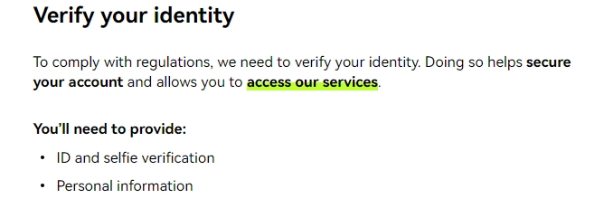

# Does OKX Require KYC?

Understanding crypto exchange verification requirements can feel like navigating a maze. If you're wondering whether you can trade on OKX without sharing your personal details, here's what you need to know: OKX has a mandatory KYC (Know Your Customer) process that every user must complete. This guide breaks down exactly what documents you'll need, how the verification works, and what limits apply to your account.

---

You know what's funny? Back in the early crypto days, everyone loved the "no questions asked" vibe of exchanges. Flash forward to today, and here we are, talking about KYC requirements like it's the most normal thing in the world.

So let's cut to the chase: **Yes, OKX requires full KYC verification.** No ifs, ands, or buts about it.

Think of it like trying to get into an exclusive club. You can stand outside all you want, but without showing your ID at the door, you're not getting in. Same deal with OKX—no verification means no trading, no deposits, and definitely no withdrawals.

## What's the Deal with OKX's Verification Process?

Here's where OKX actually makes things refreshingly simple. Unlike some exchanges that have you jumping through multiple verification hoops (Level 1, Level 2, Level 3, and so on), OKX keeps it straightforward with just one verification level.

### Level 1 KYC: The Only Level You Need

To get verified on OKX, you'll need to provide:

**Personal Information** - The basics: your name, date of birth, and nationality. Standard stuff.

**Government-Issued ID** - This could be your passport, driver's license, or national ID card. Whatever gets you through airport security will work here.

**Facial Recognition** - Yeah, you'll need to take a selfie. Don't worry about perfect lighting—just make sure you're recognizable and not wearing sunglasses like you're trying to disguise yourself.

**Proof of Address** - Here's where you dig up a recent utility bill or bank statement. The key word is "recent"—it needs to be dated within the last three months. That electric bill from last summer? Not gonna cut it.

The whole process is pretty painless, honestly. Most people get through it in about 10-15 minutes, assuming their documents are clear and readable. Pro tip: make sure your ID isn't expired. You'd be surprised how many people forget to check that.

## Understanding OKX Withdrawal Limits

Now, let's talk money—specifically, how much you can move around.

👉 [Ready to start trading with verified limits? Complete your KYC verification here](https://www.okx.com/join/47044926)

Once you're verified, your withdrawal limits kick in based on a rolling 24-hour period. This isn't like a daily reset at midnight; it's literally the past 24 hours from whenever you're making a withdrawal.

The specific limits can vary depending on market conditions and your account status, but here's the thing: having a verified account gives you access to substantially higher limits compared to unverified accounts (which, remember, can't withdraw anything).

OKX adjusts these limits periodically, so it's worth checking their official documentation for the most current numbers. But generally speaking, verified users have more than enough headroom for typical trading activities.

## Why Does OKX Even Require KYC?

Look, I get it. The whole point of crypto was supposed to be freedom from traditional financial gatekeepers, right? So why all the paperwork?

The reality is pretty straightforward: regulations. As cryptocurrency has grown from internet money to a legitimate financial industry, regulators worldwide have stepped in. Exchanges like OKX need to comply with anti-money laundering (AML) and counter-terrorism financing (CTF) regulations. It's not about being nosy—it's about staying in business and keeping the platform accessible in most countries.

Plus, there's a security angle. KYC verification actually protects you, too. It makes it harder for someone to hijack your account and drain your funds. If someone tries to change your withdrawal address to their own, the verification trail provides an extra layer of security and recoverability.

## Is Your Information Safe on OKX?

Fair question. You're handing over sensitive documents to an online platform—you should absolutely be concerned about security.

OKX is one of the largest cryptocurrency exchanges globally, serving over 50 million users. They employ industry-standard encryption and security protocols to protect user data. That said, here's some old-school crypto wisdom: **not your keys, not your crypto.**

What does that mean? Simple: even the most secure exchange is still a centralized platform. For long-term holdings or significant amounts, consider transferring your crypto to a personal hardware wallet where you control the private keys. Use OKX for trading and active management, but don't treat it like a savings account.  
  
Think of it like this: you wouldn't keep your entire life savings in cash in your pocket while walking around, right? Same principle applies here.

## The Bottom Line on OKX KYC

So, does OKX require KYC? Absolutely, and there's no way around it. But honestly, the process is pretty streamlined compared to some other exchanges out there. One verification level, clear requirements, and you're good to go.

The verification requirement might feel like a hurdle, but it's really just the new normal in the crypto space. The upside? You get access to one of the world's largest and most liquid exchanges, with competitive fees and a solid range of trading pairs.

Just gather your documents, set aside 15 minutes, and get it done. Your future trading self will thank you.

---

## Conclusion

Navigating KYC requirements doesn't have to be complicated. OKX has streamlined the verification process to a single level, making it straightforward for users to get started with trading, deposits, and withdrawals. While the requirement for identity verification might seem like an extra step, it's a necessary part of using regulated cryptocurrency platforms today. 👉 [Get verified and start trading on OKX with enhanced security and higher limits](https://www.okx.com/join/47044926) to access one of the world's leading crypto exchanges with confidence.
